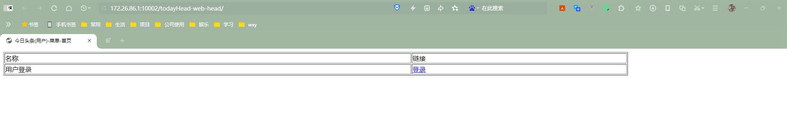
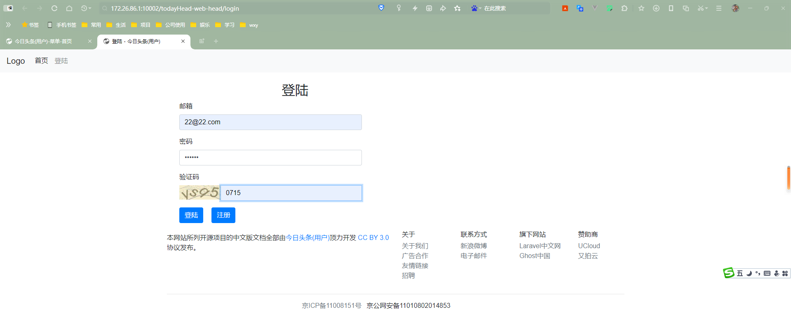
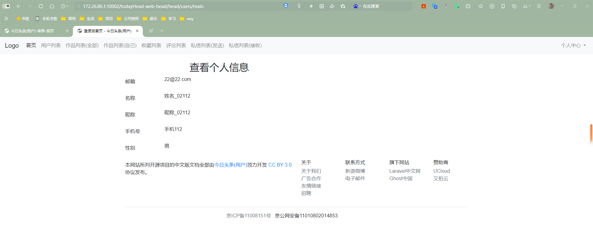

# todayHead

## 介绍
今日头条(用户)
* 前后台功能都有

## 软件架构
* 编程语言: Java(JDK21)
* 数据库: Mysql8
* 开发工具: Idea
* Maven
* 框架: SpringBoot + SSM + Mybatis-Plus + Thymeleaf

## 系统需求

* 今日头条用户部分主要包括以下功能模块： 
  * 用户注册。 
  * 用户发表作品、修改作品、删除作品，注意存储细节数据，比如作品的展现量、发表时间等。 
  * 用户可以收藏别人的作品。 
  * 用户可以评论别人的作品。 
  * 用户和用户之间可以私信交流。

## 访问信息
* 后台访问网址:http://127.0.0.1:10002/todayHead-web-head
* 用户名:22@22.com
* 密码:111111

## 系统截图

* 登录首页
  
* 前台登录页面
  
* 前台登录后首页:
  
